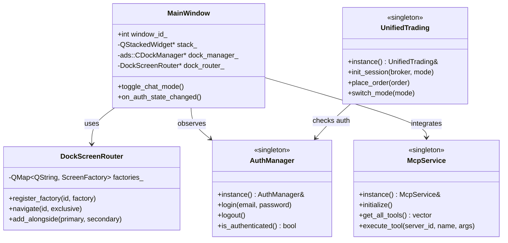
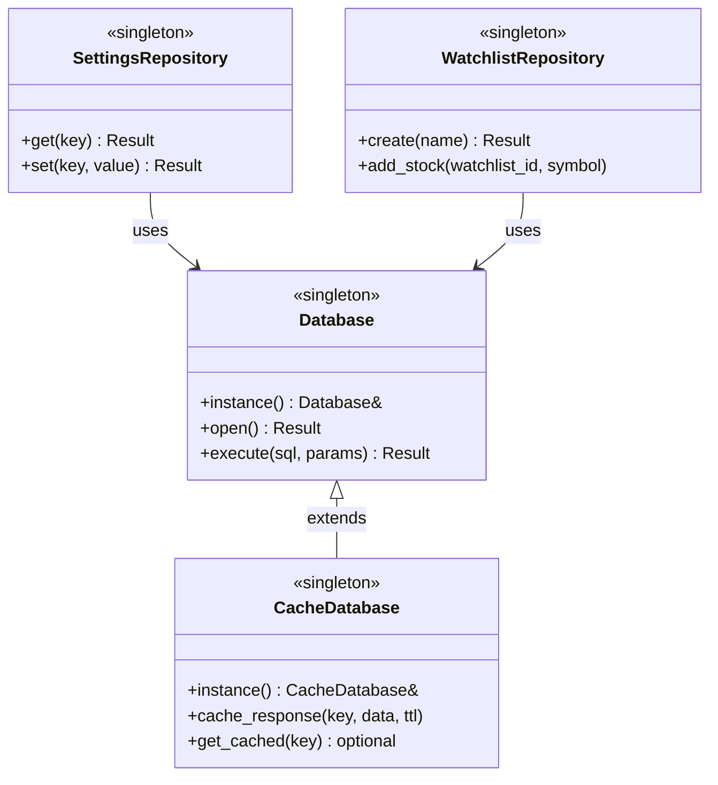
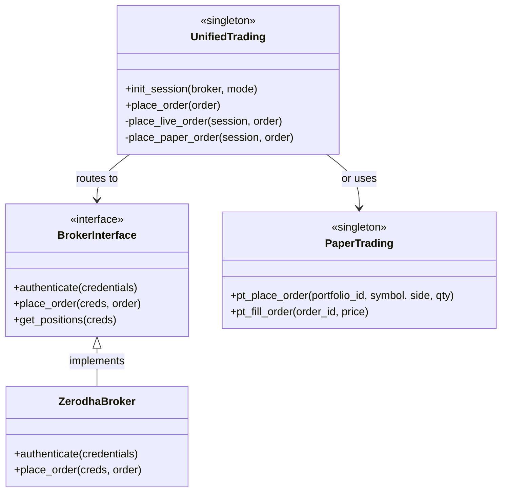
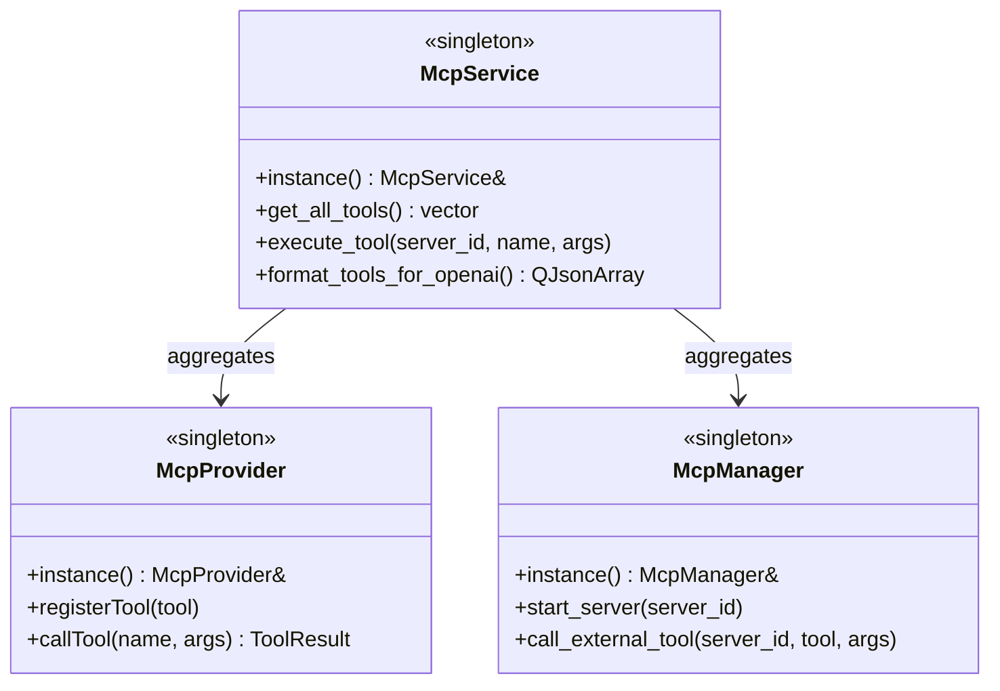
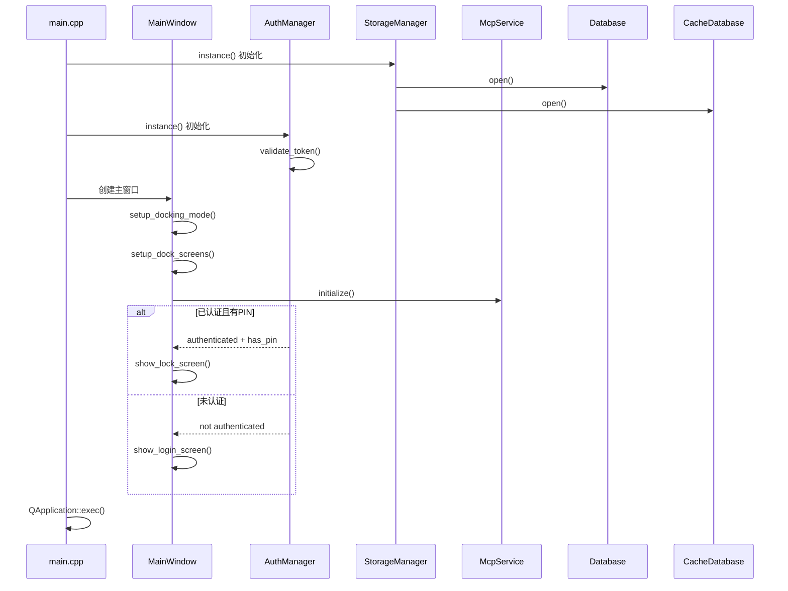
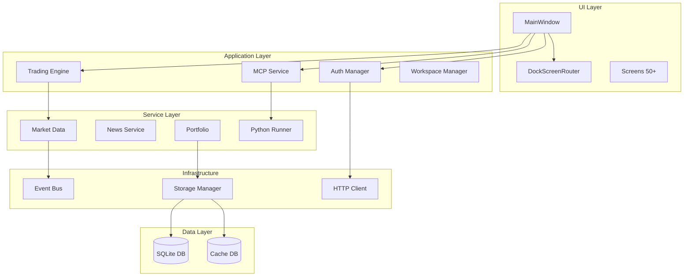

# Fincept Terminal 开发者完整指南

## 📋 目录

- [1. 与原始版本的区别](#1-与原始版本的区别)
- [2. 架构设计详解](#2-架构设计详解)
- [3. 核心数据流](#3-核心数据流)
- [4. UML 图集合](#4-uml-图集合)
- [5. 开发人员待办事项](#5-开发人员待办事项)
- [6. 扩展开发指南](#6-扩展开发指南)

---

## 1. 与原始版本的区别

### 1.1 核心架构改进

| 维度 | 原始版本 | 当前版本（v4.0.2） |
|------|---------|-------------------|
| **UI 框架** | 基础 QStackedWidget | Qt Advanced Docking System (ADS) + 多窗口支持 |
| **屏幕管理** | 简单路由 | DockScreenRouter + 懒加载工厂模式 |
| **状态持久化** | 基础几何保存 | 完整的工作空间管理 + 布局版本控制 |
| **认证系统** | 基础登录 | PIN 码保护 + 不活动锁定 + 会话恢复 |
| **数据层** | 单一数据库 | 双数据库架构 (fincept.db + cache.db) + 18次迁移 |
| **AI 集成** | 无 | MCP (Model Context Protocol) + 37个AI代理 |
| **交易系统** | 纸面交易 | 统一交易引擎 + 16家券商集成 + WebSocket实时数据 |
| **通知系统** | 无 | 模块化通知系统 (15个提供商) |
| **工作流引擎** | 无 | 可视化节点编辑器 + 执行引擎 |
| **构建优化** | 标准CMake | Unity Build + PCH + ccache/sccache |

### 1.2 新增核心模块

#### ✨ 已添加的关键组件

1. **Qt Advanced Docking System (ADS)** - 可停靠/浮动面板、多显示器支持、布局持久化
2. **MCP (Model Context Protocol) 系统** - 内部工具提供者、外部服务器管理
3. **统一交易引擎** - 抽象经纪商接口、实时/纸面交易模式切换
4. **工作空间管理器** - JSON工作空间文件、模板系统、导入/导出
5. **通知服务** - 15个通知提供商（Telegram, Discord, Slack等）
6. **工作流引擎** - 可视化节点编辑器、20+节点类型

### 1.3 技术栈升级

原始版本 → 当前版本:
C++17 → C++20
Qt 6.5 → Qt 6.8.3 (严格锁定)
单线程 → 多线程并发 (QtConcurrent)
手动内存管理 → 智能指针优先
简单日志 → 结构化日志系统

---

## 2. 架构设计详解

### 2.1 分层架构

┌─────────────────────────────────────────┐
│ Presentation Layer │
│ MainWindow | DockScreenRouter | Screens│
├─────────────────────────────────────────┤
│ Application Layer │
│ Auth | MCP | Trading | Services │
├─────────────────────────────────────────┤
│ Infrastructure Layer │
│ EventBus | Storage | Network │
├─────────────────────────────────────────┤
│ Data Layer │
│ SQLite | Cache DB | QSettings │
└─────────────────────────────────────────┘


### 2.2 核心设计模式

1. **单例模式**: AuthManager, StorageManager, EventBus, McpService
2. **工厂模式**: 屏幕懒加载、经纪商创建
3. **观察者模式**: EventBus发布/订阅、Qt信号槽
4. **仓储模式**: 19个Repository类抽象数据访问
5. **策略模式**: 交易模式切换、通知提供商
6. **外观模式**: UnifiedTrading简化复杂子系统

### 2.3 关键架构决策

- **双数据库架构**: fincept.db (主数据) + cache.db (缓存)
- **Unity Build**: 编译时间减少5-20倍
- **MCP集成**: 标准化AI工具接口，支持OpenAI格式

---

## 3. 核心数据流

### 3.1 用户认证流程

用户启动 → AuthManager检查会话 →
├─ 有效令牌 + 有PIN → 显示锁屏 → PIN验证 → 仪表板
├─ 有效令牌 + 无PIN → 显示PIN设置
└─ 无效令牌 → 显示登录界面 → API验证 → 保存令牌

### 3.2 市场数据获取流程

用户请求 → Screen → Service →
├─ 缓存命中 → 返回缓存
└─ 缓存未命中 → HTTP请求 → 解析JSON → 保存缓存 → Python分析 → 返回结果

### 3.3 交易订单流程

用户下单 → UnifiedTrading →
├─ 纸面模式 → PaperTrading → 数据库
└─ 实盘模式 → Broker接口 → 外部API → WebSocket实时更新

### 3.4 MCP工具调用流程
LLM请求 → McpService →
├─ 内部工具 → McpProvider → 执行C++代码
└─ 外部工具 → McpManager → SSE/stdio → 外部服务器

---

## 4. UML 图集合

### 4.1 核心架构类图




### 4.2 数据层类图




### 4.3 交易系统类图




### 4.4 MCP系统类图




### 4.5 应用启动序列图





4.6 组件图





### 5. 开发人员待办事项
🔴 高优先级

    1. API密钥配置
        - Polygon.io, Alpha Vantage, FRED API Keys
        - OpenAI/Anthropic API Keys (如使用)
    2. 经纪商凭据
        - Zerodha: API Key, Secret, TOTP Secret
        - Angel One: API Key, Secret, Client Code, PIN
        - Interactive Brokers: Account ID, Gateway配置

    3. 数据库迁移验证
        ```bash
        # 首次运行检查日志
        tail -f ~/.local/share/Fincept/logs/fincept.log

        # 迁移失败时重置
        rm ~/.local/share/Fincept/data/fincept.db
        ```

    4. Python环境设置

        ```bash
        # 监控安装进度
        tail -f ~/.local/share/Fincept/logs/python_setup.log

        # 手动安装依赖
        pip install -r resources/requirements-numpy2.txt
        ```


    5. Qt 6.8.3 安装
        - Windows: C:/Qt/6.8.3/msvc2022_64
        - Linux: sudo apt-get install qt6-base-dev qt6-charts-dev
        - macOS: Qt Online Installer

🟡 中优先级

    6. 主题定制 - 修改 src/ui/theme/Theme.cpp
    7. 通知提供商配置 - Telegram, Discord, Slack等
    8. 工作空间模板创建 - 自定义布局模板
    9. MCP外部服务器配置 - 添加自定义工具服务器
    10. 性能调优 - 调整Unity Build批处理大小

🟢 低优先级

    11. 国际化 (i18n) - 添加多语言支持
    12. 测试套件扩展 - 单元/集成/UI测试
    13. 文档完善 - API参考、贡献者指南
    14. CI/CD优化 - 自动化代码质量检查


### 已知问题和限制

    1.Unity Build冲突 - 某些文件需排除 (SKIP_UNITY_BUILD_INCLUSION)
    2.Qt版本锁定 - 严格依赖6.8.3，测试其他版本需 -DFINCEPT_ALLOW_QT_DRIFT=ON
    3.Python依赖 - 首次启动需5-10分钟下载安装
    4.内存占用 - 约500MB-1GB
    5.跨平台差异 - Windows需OpenSSL DLL，macOS需代码签名


### 6. 扩展开发指南
6.1 添加新屏幕

步骤1: 创建屏幕类
   ```cpp
// src/screens/my_feature/MyFeatureScreen.h
#pragma once
#include <QWidget>

namespace fincept::screens {

class MyFeatureScreen : public QWidget {
    Q_OBJECT
public:
    explicit MyFeatureScreen(QWidget* parent = nullptr);
    
public slots:
    void refresh();
    
private:
    void setupUI();
    void loadData();
};

} // namespace fincept::screens

   ```
步骤2: 注册到CMakeLists.txt

   ```CMakeListst
list(APPEND SCREEN_SOURCES
    src/screens/my_feature/MyFeatureScreen.cpp
)
步骤3: 注册到DockScreenRouter
cpp
// src/app/MainWindow.cpp
dock_router_->register_factory("my_feature", []() { 
    return new screens::MyFeatureScreen; 
});
   ```
## 6.2 添加新服务
   ```cpp
// src/services/my_service/MyService.h
#pragma once
#include <QObject>
#include <QFuture>

namespace fincept {

class MyService : public QObject {
    Q_OBJECT
public:
    static MyService& instance();
    QFuture<QJsonObject> fetchData(const QString& param);
    
signals:
    void dataReady(const QJsonObject& data);
    void errorOccurred(const QString& message);
};

} // namespace fincept

   ```
## 6.3 添加MCP工具
   ```cpp
// src/mcp/tools/MyTools.cpp
#include "mcp/McpProvider.h"

namespace fincept::mcp {

void registerMyTools(McpProvider* provider) {
    provider->registerTool({
        .name = "get_current_time",
        .description = "Get current date and time",
        .input_schema = {},
        .handler = [](const QJsonObject&) -> ToolResult {
            QDateTime now = QDateTime::currentDateTime();
            QJsonObject result;
            result["datetime"] = now.toString(Qt::ISODate);
            return ToolResult::success(result);
        }
    });
}

} // namespace fincept::mcp

   ```
## 6.4 添加数据库迁移
   ```cpp
// src/storage/sqlite/migrations/v019_my_feature.cpp
#include "MigrationRunner.h"

namespace fincept::migrations {

QString v019_my_feature() {
    return R"(
        CREATE TABLE IF NOT EXISTS my_table (
            id INTEGER PRIMARY KEY AUTOINCREMENT,
            name TEXT NOT NULL,
            created_at TIMESTAMP DEFAULT CURRENT_TIMESTAMP
        );
    )";
}

} // namespace fincept::migrations

   ```

// 在 MigrationRunner.cpp 中注册
   ```cpp
REGISTER_MIGRATION(19, v019_my_feature);
   ```
## 6.5 常用命令
     ```bash
    # 构建项目
    cd fincept-qt
    cmake --preset win-release
    cmake --build --preset win-release

    # 清理构建
    rm -rf build/win-release

    # 运行测试
    cmake -B build -DFINCEPT_BUILD_TESTS=ON
    cd build && ctest

    # 生成安装包
    cmake -B build -DFINCEPT_BUILD_INSTALLER=ON -DDEPLOY_QT=ON
    cd build && cpack -G IFW -C Release

    # Docker构建
    docker build -t fincept-terminal .
    docker run --rm -e DISPLAY=$DISPLAY \
    -v /tmp/.X11-unix:/tmp/.X11-unix fincept-terminal

     ```

## 6.6 调试技巧
   ```cpp
// 1. 启用详细日志
LOG_DEBUG("Tag", "Detailed info: " + variable);

// 2. 查看日志文件
// Windows: %APPDATA%\Fincept\logs\
// Linux: ~/.local/share/Fincept/logs/
// macOS: ~/Library/Application Support/Fincept/logs/

// 3. 实时监控
tail -f ~/.local/share/Fincept/logs/fincept.log

// 4. 数据库检查
sqlite3 ~/.local/share/Fincept/data/fincept.db
.tables
.schema table_name

   ```
## 附录: 快速参考
A. 性能优化建议
 1. 减少不必要的信号槽连接
 2. 使用懒加载工厂
 3. 缓存频繁访问的数据
 4. 异步执行耗时操作
 5. 避免在主线程进行I/O
 6. 使用Unity Build加速编译
 7. 定期清理缓存数据库

B. 资源链接
- Qt 6.8 文档
- CMake 文档
- SQLite 文档
- Model Context Protocol
- Qt Advanced Docking

文档版本: 1.0
最后更新: 2026-04-20
适用版本: Fincept Terminal v4.0.2+


    